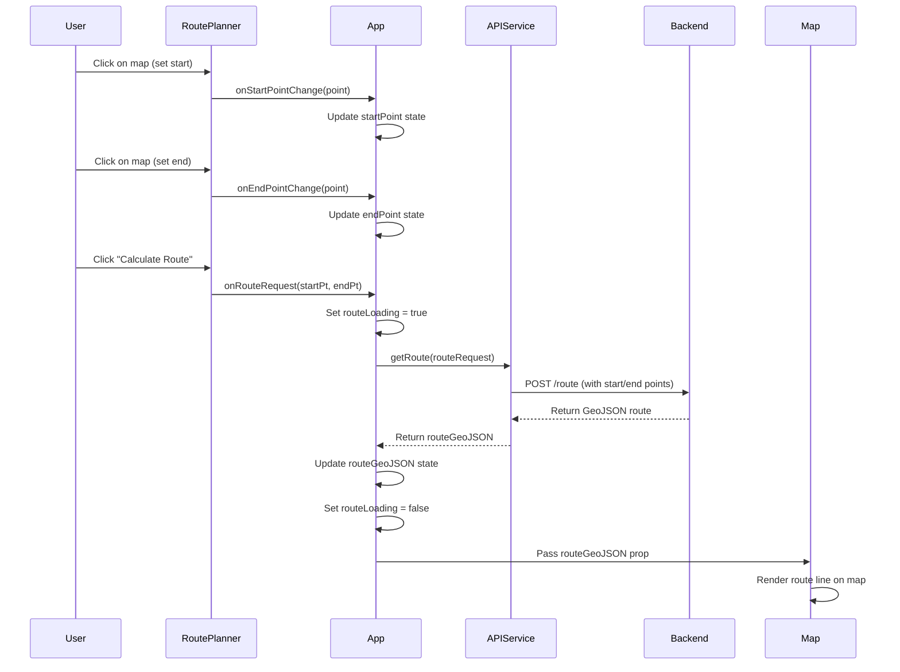
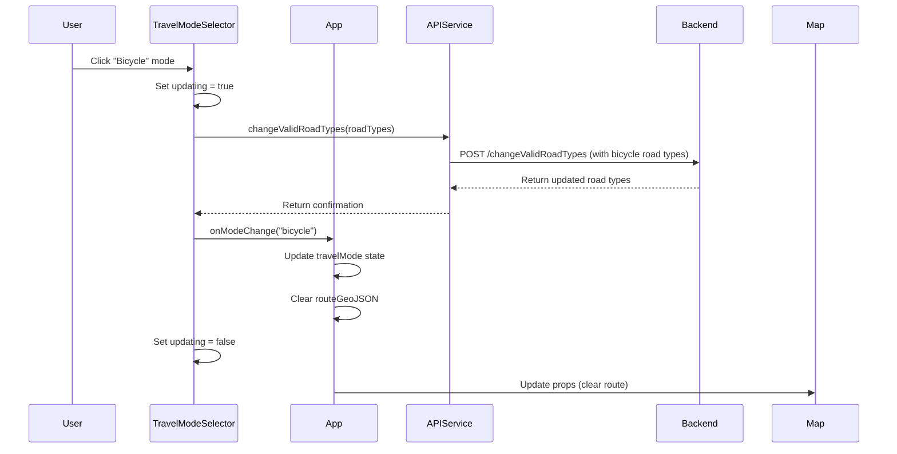
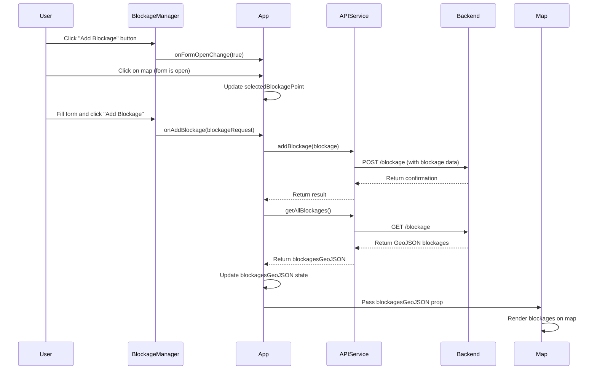
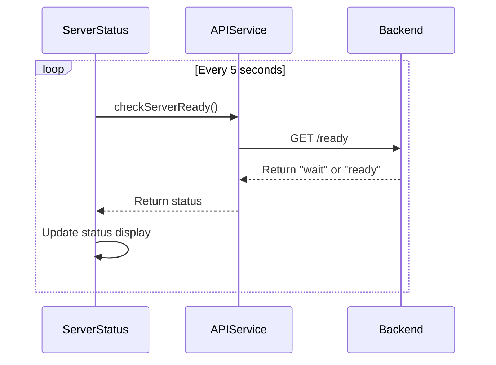

# Software Design Description

This document describes the software design of the Singapore Routing App UI, including architecture, components, and sequence diagrams.

## Overview

The Singapore Routing App UI is a single-page web application built with React and TypeScript. It provides an interactive map interface for route planning in Singapore using OpenStreetMap data.

## Architecture

### Technology Stack

- **Frontend Framework**: React 18.2
- **Language**: TypeScript 5.2
- **Build Tool**: Vite 5.0
- **Map Library**: Leaflet 1.9.4 with react-leaflet 4.2
- **HTTP Client**: Axios 1.6
- **Styling**: Inline styles (CSS-in-JS approach)

### Application Structure

```
src/
├── components/          # React components
│   ├── Map.tsx         # Main map component with Leaflet
│   ├── RoutePlanner.tsx # Route planning UI
│   ├── TravelModeSelector.tsx # Travel mode selection
│   ├── BlockageManager.tsx # Blockage management UI
│   ├── RoadTypeViewer.tsx # Road type visualization
│   └── ServerStatus.tsx # Server status indicator
├── services/           # API service layer
│   └── api.ts         # All backend API calls
├── types/             # TypeScript type definitions
│   ├── api.ts        # API-related types
│   └── travelModes.ts # Travel mode configurations
├── App.tsx           # Main application component
├── App.css           # Global styles
└── main.tsx          # Application entry point
```

## Component Architecture

### Component Hierarchy

```
App
├── Map
│   ├── TileLayer (OpenStreetMap)
│   ├── GeoJSONLayer (Route)
│   ├── GeoJSONLayer (Road Types)
│   ├── GeoJSONLayer (Blockages)
│   ├── Marker (Start Point)
│   ├── Marker (End Point)
│   └── MapUpdater
├── RoutePlanner
├── TravelModeSelector
├── RoadTypeViewer
├── BlockageManager
└── ServerStatus
```

### Component Responsibilities

#### App Component

**Purpose**: Main application container that manages state and coordinates between components.

**State Management**:
- Route planning state (start/end points)
- Route GeoJSON data
- Road type GeoJSON data
- Blockages GeoJSON data
- Travel mode selection
- Blockage form open state
- Loading states

**Key Responsibilities**:
- Initialize application
- Coordinate between map and UI components
- Handle route calculation requests
- Manage blockage CRUD operations
- Handle travel mode changes

#### Map Component

**Purpose**: Renders the interactive map using Leaflet and displays all geographic data.

**Props**:
- `center`: Map center coordinates
- `zoom`: Initial zoom level
- `routeGeoJSON`: Route to display
- `roadTypeGeoJSON`: Road type data to visualize
- `blockagesGeoJSON`: Blockage data to display
- `startPoint`: Start point marker
- `endPoint`: End point marker
- `onMapClick`: Callback for map clicks

**Key Responsibilities**:
- Render OpenStreetMap tiles
- Display GeoJSON layers (routes, roads, blockages)
- Handle map interactions (click, pan, zoom)
- Auto-fit bounds to show routes/features
- Display markers for start/end points

#### RoutePlanner Component

**Purpose**: UI panel for setting start/end points and calculating routes.

**Props**:
- `onRouteRequest`: Callback when route is requested
- `startPoint`: Current start point
- `endPoint`: Current end point
- `onStartPointChange`: Callback to update start point
- `onEndPointChange`: Callback to update end point
- `loading`: Loading state for route calculation

**Key Responsibilities**:
- Display start/end point coordinates
- Allow entering descriptions
- Trigger route calculation
- Clear points

#### TravelModeSelector Component

**Purpose**: UI panel for selecting travel mode (car, bicycle, walking, bus).

**Props**:
- `selectedMode`: Currently selected travel mode
- `onModeChange`: Callback when mode changes

**Key Responsibilities**:
- Display available travel modes
- Update backend valid road types when mode changes
- Visual feedback for selected mode

#### BlockageManager Component

**Purpose**: UI panel for viewing, adding, and deleting blockages.

**Props**:
- `blockages`: List of current blockages
- `onAddBlockage`: Callback to add blockage
- `onDeleteBlockage`: Callback to delete blockage
- `selectedPoint`: Currently selected point for new blockage
- `onFormOpenChange`: Callback when form opens/closes

**Key Responsibilities**:
- Display list of blockages
- Form for adding new blockages
- Delete functionality
- Display blockage details

#### RoadTypeViewer Component

**Purpose**: UI panel for visualizing specific road types on the map.

**Props**:
- `onRoadTypeSelect`: Callback when road type is selected

**Key Responsibilities**:
- Fetch and display available road types
- Allow selection of road type to visualize
- Clear visualization

#### ServerStatus Component

**Purpose**: Display server readiness status.

**Key Responsibilities**:
- Poll server readiness endpoint
- Display status with color coding
- Update status periodically

## Data Flow

### Route Calculation Flow

1. User sets start point (click on map)
2. User sets end point (click on map)
3. User clicks "Calculate Route"
4. App component calls `getRoute` API service
5. API service sends POST request to `/route` endpoint
6. Backend returns GeoJSON route data
7. App updates `routeGeoJSON` state
8. Map component receives props and renders route

### Travel Mode Change Flow

1. User selects travel mode (e.g., Bicycle)
2. TravelModeSelector calls `changeValidRoadTypes` API
3. API service sends POST request with new road types
4. Backend updates valid road types
5. Component updates selected mode state
6. Route is cleared (if exists)
7. Next route calculation uses new road types

### Blockage Management Flow

**Add Blockage**:
1. User opens blockage form by clicking "Add Blockage" button
2. User clicks map to select location (when form is open)
3. User fills blockage form
4. User clicks "Add Blockage" to submit
5. App calls `addBlockage` API service
6. API sends POST request to `/blockage` endpoint
7. Backend adds blockage
8. App reloads all blockages
9. Map displays new blockage

**Delete Blockage**:
1. User clicks "Delete" on a blockage
2. App calls `deleteBlockage` API service
3. API sends DELETE request to `/blockage/{name}` endpoint
4. Backend removes blockage
5. App reloads all blockages
6. Map updates to remove blockage

## Sequence Diagrams

### Sequence Diagram: Calculate Route



### Sequence Diagram: Change Travel Mode



### Sequence Diagram: Add Blockage



### Sequence Diagram: Server Status Check



## State Management

The application uses React's built-in state management (useState hooks). Key state variables:

### App Component State

- `startPoint`: Point | null - Start point for routing
- `endPoint`: Point | null - End point for routing
- `routeGeoJSON`: GeoJSON | null - Calculated route data
- `roadTypeGeoJSON`: GeoJSON | null - Currently visualized road type
- `blockagesGeoJSON`: GeoJSON | null - All blockages data
- `travelMode`: TravelMode - Currently selected travel mode
- `selectedBlockagePoint`: {lat, lng} | null - Point selected for new blockage
- `routeLoading`: boolean - Loading state for route calculation
- `blockageFormOpen`: boolean - Whether blockage form is open
- `blockages`: Array - List of blockage objects

## API Service Layer

The API service layer (`src/services/api.ts`) provides a clean interface to backend APIs:

- All API calls are centralized
- TypeScript types ensure type safety
- Error handling can be added consistently
- Easy to mock for testing

### API Functions

- `checkServerReady()`: Check server readiness
- `getAllRoadTypes()`: Get all available road types
- `getValidRoadTypes()`: Get current valid road types
- `getRoadTypeGeoJSON(roadType)`: Get GeoJSON for specific road type
- `changeValidRoadTypes(roadTypes)`: Update valid road types
- `getRoute(routeRequest)`: Calculate route
- `getAllBlockages()`: Get all blockages
- `addBlockage(blockage)`: Add new blockage
- `deleteBlockage(name)`: Delete blockage

## Error Handling

- API errors are handled with try-catch blocks
- Basic error messages are shown to users when operations fail
- Loading states provide feedback during API calls

## Styling Approach

- **Inline Styles**: Used for component-specific styles
- **CSS File**: Global styles in `App.css`
- **Leaflet CSS**: Included via CDN in `index.html`

Rationale: Simple styling approach suitable for this application size. For larger applications, consider CSS Modules or styled-components.

## Performance Considerations

1. **Map Rendering**: Leaflet efficiently handles large GeoJSON datasets
2. **Route Updates**: Route GeoJSON keyed properly to trigger re-renders only when needed
3. **Status Polling**: Server status checked every 5 seconds (reasonable interval)
4. **Road Type Visualization**: Only one road type visualized at a time to limit data

## Future Enhancements

Potential improvements:

1. **State Management**: Consider Redux or Zustand for complex state
2. **Caching**: Cache road types and blockages
3. **Offline Support**: Service workers for offline functionality
4. **Accessibility**: Enhanced keyboard navigation and screen reader support
5. **Testing**: Unit tests and E2E tests

## Dependencies

### Production Dependencies

- `react`: ^18.2.0 - UI framework
- `react-dom`: ^18.2.0 - React DOM rendering
- `leaflet`: ^1.9.4 - Map library
- `react-leaflet`: ^4.2.1 - React bindings for Leaflet
- `axios`: ^1.6.2 - HTTP client

### Development Dependencies

- `typescript`: ^5.2.2 - TypeScript compiler
- `vite`: ^5.0.8 - Build tool
- `@vitejs/plugin-react`: ^4.2.1 - Vite React plugin
- ESLint and TypeScript ESLint plugins

## Build and Deployment

### Development

```bash
npm run dev
```

Starts development server on `http://localhost:3000`

### Production Build

```bash
npm run build
```

Creates optimized production build in `dist/` directory.

### Preview Production Build

```bash
npm run preview
```

Preview the production build locally.

## Version History

| Version | Date | Changes |
|---------|------|---------|
| 1.0 | 2024-01-XX | Initial software design description |

